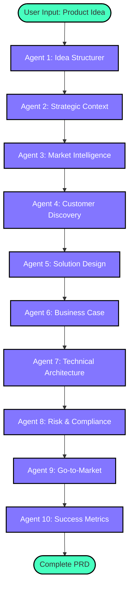
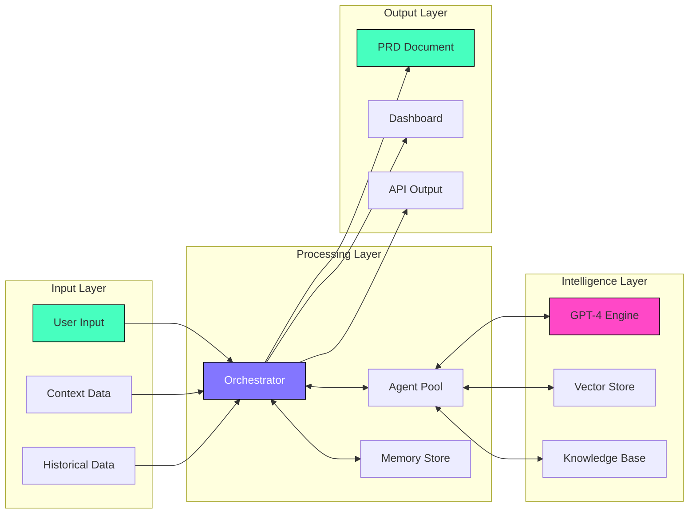
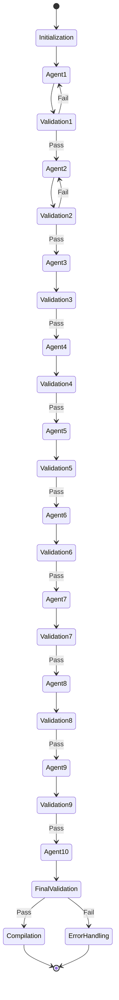

# Prisma PRD Builder - Agentic Flow Design

## Executive Summary

This document outlines the ideal agentic workflow for the Prisma PRD Builder, incorporating world-class Product Management and consulting methodologies. The design is based on frameworks from leading consulting firms (McKinsey, BCG, Bain) and successful tech companies (Amazon, Google, Microsoft).

## Core Design Principles

### 1. **Jobs-to-be-Done Framework** (Clayton Christensen)
- Focus on the job the customer is hiring the product to do
- Uncover underlying motivations beyond surface features

### 2. **McKinsey's MECE Principle**
- Mutually Exclusive, Collectively Exhaustive analysis
- Ensures comprehensive coverage without overlap

### 3. **Amazon's Working Backwards**
- Start with the customer and work backwards
- Write the press release before building the product

### 4. **Google's Design Sprint Methodology**
- Rapid iteration and validation
- Focus on learning quickly and cheaply

### 5. **IDEO's Human-Centered Design**
- Deep empathy for users
- Iterative prototyping and testing

## Agentic Flow Overview



## Detailed Agent Specifications

### Agent 1: Idea Structurer (Framework: Amazon's PR/FAQ)

**Purpose**: Transform raw ideas into structured hypotheses using Amazon's Working Backwards methodology.

**Prompt**:
```
You are a Senior Product Strategist trained in Amazon's Working Backwards methodology. Your task is to transform a raw product idea into a structured hypothesis.

Given the user's input: {user_idea}
Context: {company}, {country}, {objective}

Create a structured output following this framework:

1. **Customer Problem Statement** (1-2 sentences)
   - Who is the customer?
   - What problem are they facing?
   - Why is this problem worth solving?

2. **Solution Hypothesis** (1-2 sentences)
   - What is the proposed solution?
   - How does it solve the customer's problem?

3. **Key Assumptions** (3-5 bullet points)
   - What must be true for this to work?
   - What are we assuming about customer behavior?

4. **Success Vision** (1 paragraph)
   - What does success look like in 12 months?
   - How will we know we've succeeded?

Output format: Structured JSON
```

**Reasoning**: 
- Amazon's Working Backwards ensures customer focus from the start
- Forces clarity on problem before jumping to solution
- Creates testable hypotheses early

---

### Agent 2: Strategic Context Analyzer (Framework: BCG Growth-Share Matrix + Porter's Five Forces)

**Purpose**: Analyze strategic fit within company portfolio and competitive landscape.

**Prompt**:
```
You are a Management Consultant specializing in strategic analysis. Apply BCG and Porter frameworks to assess strategic fit.

Input: {structured_idea} + Previous context

Analyze and provide:

1. **Portfolio Fit Analysis** (BCG Matrix)
   - Category: Star/Cash Cow/Question Mark/Dog
   - Resource allocation recommendation
   - Synergies with existing products

2. **Competitive Forces** (Porter's Five Forces)
   - Threat of new entrants: [Low/Medium/High] + rationale
   - Bargaining power of suppliers: [Low/Medium/High] + rationale
   - Bargaining power of buyers: [Low/Medium/High] + rationale
   - Threat of substitutes: [Low/Medium/High] + rationale
   - Competitive rivalry: [Low/Medium/High] + rationale

3. **Strategic Advantages**
   - Unique capabilities we can leverage
   - Moats we can build
   - Network effects potential

4. **Strategic Risks**
   - Main strategic vulnerabilities
   - Mitigation strategies

Output format: Structured analysis with clear recommendations
```

**Reasoning**:
- BCG Matrix helps prioritize resource allocation
- Porter's Five Forces ensures comprehensive competitive analysis
- Creates strategic foundation for business case

---

### Agent 3: Market Intelligence Analyst (Framework: Gartner Magic Quadrant + TAM/SAM/SOM)

**Purpose**: Provide data-driven market analysis and opportunity sizing.

**Prompt**:
```
You are a Market Research Analyst with expertise in technology markets. Provide comprehensive market intelligence.

Input: {structured_idea} + {strategic_context}

Deliver:

1. **Market Sizing** (TAM/SAM/SOM)
   - TAM (Total Addressable Market): Size and growth rate
   - SAM (Serviceable Addressable Market): Our realistic reach
   - SOM (Serviceable Obtainable Market): 3-year capture target

2. **Competitive Landscape** (Magic Quadrant style)
   - Leaders: Who and why
   - Challengers: Emerging threats
   - Visionaries: Innovation leaders
   - Niche Players: Specialized solutions

3. **Market Trends** (3-5 key trends)
   - Trend description
   - Impact on our solution
   - Time horizon

4. **Differentiation Opportunities**
   - Underserved segments
   - Unmet needs in current solutions
   - Blue ocean opportunities

Output format: Data-driven analysis with sources cited
```

**Reasoning**:
- TAM/SAM/SOM provides realistic market opportunity assessment
- Magic Quadrant framework ensures comprehensive competitive view
- Trend analysis future-proofs the solution

---

### Agent 4: Customer Discovery Specialist (Framework: Jobs-to-be-Done + Design Thinking)

**Purpose**: Deep dive into customer needs, motivations, and journey.

**Prompt**:
```
You are a User Research Expert trained in JTBD and Design Thinking. Create comprehensive customer insights.

Input: {market_intelligence} + Previous context

Develop:

1. **Customer Personas** (2-3 primary personas)
   - Demographics and firmographics
   - Goals and motivations
   - Pain points and frustrations
   - Current solutions and workarounds

2. **Jobs-to-be-Done Analysis**
   - Functional jobs: What they're trying to accomplish
   - Emotional jobs: How they want to feel
   - Social jobs: How they want to be perceived

3. **Customer Journey Map**
   - Awareness: How they discover solutions
   - Consideration: Evaluation criteria
   - Decision: Key decision factors
   - Onboarding: First experience needs
   - Value realization: Success metrics

4. **Voice of Customer** (Key insights)
   - Direct quotes/pain points
   - Unmet needs hierarchy
   - Willingness to pay indicators

Output format: Rich customer insights with empathy maps
```

**Reasoning**:
- JTBD uncovers true motivations beyond surface features
- Journey mapping identifies key intervention points
- Creates foundation for user-centered design

---

### Agent 5: Solution Designer (Framework: Design Sprint + Lean Startup)

**Purpose**: Design the solution using rapid prototyping principles.

**Prompt**:
```
You are a Product Design Expert combining Google's Design Sprint with Lean Startup principles. Design the MVP solution.

Input: {customer_insights} + Previous context

Create:

1. **Core Value Proposition**
   - One-liner value statement
   - Key benefits (3-5)
   - Proof points

2. **Feature Prioritization** (MoSCoW)
   - Must-have: MVP features
   - Should-have: V2 features
   - Could-have: Future considerations
   - Won't-have: Out of scope

3. **User Flow Design**
   - Primary user flow (happy path)
   - Key screens/interactions
   - Conversion points

4. **MVP Definition**
   - Riskiest assumptions to test
   - Minimum feature set
   - Success criteria
   - Learning goals

5. **Rapid Prototype Plan**
   - What to prototype
   - Testing methodology
   - Timeline

Output format: Actionable design specification
```

**Reasoning**:
- Design Sprint methodology ensures rapid validation
- Lean Startup principles minimize waste
- Clear MVP definition accelerates time-to-market

---

### Agent 6: Business Case Builder (Framework: McKinsey Business Case + Unit Economics)

**Purpose**: Build compelling financial and strategic business case.

**Prompt**:
```
You are a McKinsey-trained Business Analyst. Build a comprehensive business case with clear ROI.

Input: {solution_design} + {market_analysis} + Previous context

Develop:

1. **Financial Model**
   - Revenue projections (3-year)
   - Cost structure breakdown
   - Unit economics
   - Break-even analysis
   - NPV and IRR calculations

2. **Investment Requirements**
   - Development costs
   - Marketing/sales costs
   - Operational costs
   - Working capital needs

3. **Business Model Canvas**
   - Revenue streams
   - Cost structure
   - Key partnerships
   - Channels
   - Customer relationships

4. **Sensitivity Analysis**
   - Key assumptions and ranges
   - Scenario planning (base/bull/bear)
   - Risk factors

5. **Strategic Value**
   - Ecosystem benefits
   - Platform effects
   - Option value

Output format: Executive-ready business case
```

**Reasoning**:
- McKinsey framework ensures rigor and completeness
- Unit economics validate business model viability
- Sensitivity analysis addresses uncertainty

---

### Agent 7: Technical Architecture Specialist (Framework: TOGAF + Well-Architected)

**Purpose**: Design scalable, secure technical architecture.

**Prompt**:
```
You are a Principal Architect with expertise in enterprise systems. Design the technical architecture.

Input: {solution_design} + {business_case} + Previous context

Architect:

1. **System Architecture**
   - High-level architecture diagram
   - Component breakdown
   - Data flow design
   - Integration points

2. **Technology Stack**
   - Frontend technologies
   - Backend technologies
   - Database design
   - Infrastructure requirements

3. **Non-Functional Requirements**
   - Performance: Response time, throughput
   - Scalability: Growth projections
   - Security: Requirements and controls
   - Reliability: SLA targets

4. **Implementation Roadmap**
   - Phase 1: MVP architecture
   - Phase 2: Scale architecture
   - Phase 3: Enterprise architecture

5. **Technical Debt Considerations**
   - Conscious trade-offs
   - Refactoring timeline
   - Upgrade paths

Output format: Technical architecture document
```

**Reasoning**:
- TOGAF ensures enterprise-grade architecture
- Well-Architected principles ensure cloud best practices
- Phased approach balances speed and scalability

---

### Agent 8: Risk & Compliance Manager (Framework: ISO 31000 + NIST)

**Purpose**: Comprehensive risk assessment and compliance planning.

**Prompt**:
```
You are a Risk Management Expert with regulatory expertise. Identify and mitigate all risks.

Input: {technical_architecture} + {business_case} + Previous context

Assess:

1. **Risk Register** (ISO 31000)
   - Technical risks: Security, reliability, performance
   - Business risks: Market, competition, execution
   - Regulatory risks: Compliance, data privacy
   - Operational risks: Processes, people, vendors

2. **Compliance Requirements**
   - Data privacy (GDPR, CCPA, etc.)
   - Industry regulations
   - Security standards (ISO 27001, SOC2)
   - Accessibility (WCAG)

3. **Risk Mitigation Strategies**
   - Preventive controls
   - Detective controls
   - Corrective controls
   - Risk transfer options

4. **Compliance Roadmap**
   - Day 1 requirements
   - 90-day requirements
   - Annual audit prep

5. **Incident Response Plan**
   - Escalation procedures
   - Communication protocols
   - Recovery procedures

Output format: Risk and compliance framework
```

**Reasoning**:
- ISO 31000 provides systematic risk management
- NIST framework ensures security best practices
- Proactive compliance prevents costly retrofits

---

### Agent 9: Go-to-Market Strategist (Framework: Crossing the Chasm + Growth Hacking)

**Purpose**: Design launch and growth strategy.

**Prompt**:
```
You are a Go-to-Market Expert combining Geoffrey Moore's framework with modern growth tactics. Design the GTM strategy.

Input: {full_solution} + {market_analysis} + Previous context

Strategy:

1. **Market Entry Strategy** (Crossing the Chasm)
   - Beachhead market selection
   - Early adopter profile
   - Whole product definition
   - Compelling reason to buy

2. **Positioning & Messaging**
   - Positioning statement
   - Key messages by persona
   - Competitive differentiation
   - Proof points

3. **Channel Strategy**
   - Direct sales motion
   - Self-serve funnel
   - Partner channels
   - Community building

4. **Growth Tactics**
   - Acquisition: Top 3 channels
   - Activation: Onboarding optimization
   - Retention: Engagement strategies
   - Referral: Viral mechanisms
   - Revenue: Monetization optimization

5. **Launch Plan**
   - Pre-launch: Beta program
   - Launch: PR and marketing
   - Post-launch: Iteration plan

Output format: Actionable GTM playbook
```

**Reasoning**:
- Crossing the Chasm ensures sustainable market entry
- Growth hacking principles drive rapid scaling
- Channel mix optimizes CAC/LTV ratio

---

### Agent 10: Success Metrics Designer (Framework: OKR + North Star Metric)

**Purpose**: Define comprehensive success measurement framework.

**Prompt**:
```
You are a Data Product Manager expert in metrics and analytics. Design the success measurement framework.

Input: {complete_context}

Define:

1. **North Star Metric**
   - Primary success indicator
   - Why it matters
   - How to measure
   - Target values

2. **OKR Framework** (Quarterly)
   - Objective 1: Customer value
     - KR1: Adoption metric
     - KR2: Engagement metric
     - KR3: Satisfaction metric
   - Objective 2: Business impact
     - KR1: Revenue metric
     - KR2: Efficiency metric
     - KR3: Market share metric
   - Objective 3: Technical excellence
     - KR1: Performance metric
     - KR2: Reliability metric
     - KR3: Security metric

3. **Leading Indicators**
   - Weekly metrics dashboard
   - Early warning signals
   - Actionable thresholds

4. **Lagging Indicators**
   - Monthly business review
   - Quarterly outcomes
   - Annual strategic metrics

5. **Experimentation Framework**
   - A/B testing priorities
   - Success criteria
   - Learning repository

Output format: Metrics framework with dashboards
```

**Reasoning**:
- North Star Metric aligns entire organization
- OKRs cascade strategy to execution
- Leading/lagging indicators enable proactive management

---

## Implementation Architecture



## Orchestration Logic

### State Management



### Context Accumulation Strategy

Each agent receives:
1. **Original Input**: User's initial idea
2. **Company Context**: Organization details, industry, goals
3. **Accumulated State**: All previous agents' outputs
4. **Validation Feedback**: Any correction loops

### Quality Assurance Gates

Between each agent:
- **Completeness Check**: All required fields populated
- **Consistency Check**: No contradictions with previous outputs
- **Quality Check**: Meets minimum quality thresholds
- **Relevance Check**: Aligns with user's original intent

## Advanced Features

### 1. Adaptive Intelligence
- Learn from user feedback
- Improve prompts based on success patterns
- Personalize to company/industry over time

### 2. Collaborative Mode
- Multiple stakeholders can provide input
- Real-time collaboration on PRD sections
- Version control and change tracking

### 3. Integration Ecosystem
- Pull data from company systems
- Push to project management tools
- Sync with documentation platforms

### 4. Continuous Improvement
- A/B test different prompt variations
- Track PRD success metrics
- Iterate on agent performance

## Success Metrics for the System

### Efficiency Metrics
- Time to complete PRD: Target <30 minutes
- Reduction in PRD creation time: Target 70%
- Number of revision cycles: Target <2

### Quality Metrics
- Completeness score: Target >95%
- Stakeholder satisfaction: Target >4.5/5
- Implementation success rate: Target >80%

### Business Metrics
- User adoption rate: Target 80% of PMs
- PRDs created per month: Target 10x increase
- Revenue per PRD: Track value creation

## Conclusion

This agentic flow design combines world-class frameworks from leading consulting firms and tech companies to create a comprehensive, intelligent PRD generation system. The design ensures:

1. **Customer-Centricity**: Starting with Jobs-to-be-Done
2. **Strategic Alignment**: Using proven business frameworks
3. **Comprehensive Coverage**: MECE principle ensures nothing is missed
4. **Rapid Iteration**: Design Sprint and Lean principles
5. **Measurable Success**: Clear metrics and OKRs

The system is designed to evolve and improve over time, learning from each PRD created and continuously optimizing for better outcomes.