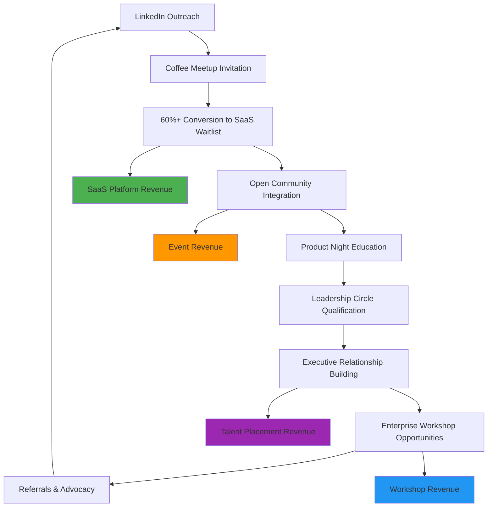

> ⛔ NON-NEGOTIABLE: DO NOT EDIT THIS DOCUMENT unless explicitly requested/solicited. Fixed business context. Unintended agentic changes prohibited.
> ⛔ NO NEGOCIABLE: NO EDITAR ESTE DOCUMENTO salvo solicitud explícita. Contexto de negocio fijo. Prohibidas modificaciones agenticas no intencionadas.

---

# Prisma Business Model & Growth Strategy

## Overview

Prisma operates a community-first business model with four revenue channels supported by a sophisticated top-of-funnel community strategy. The community serves as the primary acquisition and qualification engine, creating a flywheel effect that drives sustainable growth across all revenue streams.

## Business Model Architecture

*See `brandbook.md` for complete brand guidelines including the Flywheel Icon System (Ojos/Cyan for Cafes, Explosión/Pink for Product Nights, Chispa/Monochrome for Executive Dinners, Trébol/Purple for Talent) and core brand principles (Curation over volume, Value density, Relationship-first).*

### Revenue Channels

| **Channel** | **Status** | **Target Market** | **Revenue Potential** | **Community Integration** |
|-------------|------------|-------------------|------------------------|---------------------------|
| **SaaS Platform** | Waitlist/Pre-launch | Individual PMs & Teams | $500K+ ARR | Primary conversion target |
| **AI Workshops** | Active | Enterprises, Teams, Individuals | $200K+ Annual | Community-driven demand |
| **Prisma Talent** | Pilot/Active | Hiring Managers & TA Teams | $250K+ Annual | Community-validated placements |
| **Event Tickets** | Active (Minimal) | Community Members | $50K Annual | Relationship maintenance |

### Revenue Channel Details

#### 1. SaaS Platform (Primary Revenue Driver)
- **Product**: PRD Builder and AI-powered PM tools
- **Status**: Currently in waitlist stage, preparing for launch
- **Target Revenue**: $500K+ ARR within 18 months
- **Pricing Model**: Freemium with premium tiers
- **Community Path**: Coffee Meetups → Demo → Conversion → Leadership Circle

#### 2. AI Workshops (Secondary Revenue)
- **Service**: Custom AI training for PM teams and enterprises
- **Target Market**: 
  - **Enterprises**: Large companies implementing AI in product workflows
  - **Teams**: Mid-size product teams seeking AI transformation
  - **Individuals**: Senior PMs wanting to upskill in AI tools
- **Revenue Potential**: $200K+ annually
- **Community Path**: Leadership Circle → Custom Training → Enterprise Partnerships

#### 3. Event Tickets (Relationship Maintenance)
- **Philosophy**: "We do not intend to get rich from events"
- **Purpose**: Community relationship building and top-of-funnel qualification
- **Revenue**: Minimal ($50K annually), covers costs
- **Strategic Value**: Primary acquisition and community building mechanism

#### 4. Prisma Talent (Lean Headhunting Service MVP)
- **Service**: Streamlined headhunting service for Product, Growth, and Tech roles
- **Status**: MVP/Active
- **Target Market**:
  - Hiring Managers (Director, VP, C-level) for Product, Growth, and Engineering roles
  - Talent Acquisition and HR leaders seeking higher-quality pipelines
  - Startups and scale-ups in LATAM (initially Peru), expanding regionally

**MVP Service Flow**:
1. **Intake**: Single form collects role requirements
2. **Scoping**: One 45-min call produces Position Blueprint + AI-assisted Job Description (max one revision)
3. **Distribution**: Role distributed manually by Prisma team via WhatsApp, email, LinkedIn
4. **Collection**: Candidate applications (CV upload + role-specific questions) into central database
5. **Validation**: Manual background check + 15-30 min screening call + basic reference checks
6. **Delivery**: 3-5 candidate shortlist with evidence, risks, and interview guidance
7. **Introduction**: Warm introductions and tracking to offer for commission billing
8. **Guarantee**: 60-day replacement guarantee

**In Scope**:
- Multiple concurrent roles per client
- Templates for Blueprint/JD/shortlist/emails
- SLAs: ≤10 business days to shortlist
- Manual screening only
- Payment via invoice

**Not In Scope**:
- ATS or HRIS integrations
- Client portals/dashboards
- Automated peer/community validation
- Multi-country legal/payroll support
- Employer branding campaigns
- Psychometrics or technical coding tests
- Complex analytics or ML scoring
- Social paid ads
- Long-term candidate coaching or onboarding

- **Business Model**: Contingent search 20-30% first-year salary
- **Community Path**: Open Community → Leadership Circle relationships → Talent brief → Curated shortlist → Placement
- **Revenue Potential**: $250K+ annually (10-15 senior placements/yr)

---

## Growth Loop Architecture

### The Prisma Community Flywheel

### Growth Loop Components

#### **Acquisition Loop**
1. **LinkedIn Professional Outreach** → Target senior PMs with AI-related content
2. **Content Marketing** → Thought leadership positioning in PM community
3. **Referral Program** → Leadership Circle members bring qualified prospects
4. **Partner Network** → Strategic partnerships with complementary services

#### **Activation Loop**  
1. **Coffee Meetup Experience** → 2.5-hour conversion-focused experience
2. **Value Demonstration** → Live PRD Builder demo showing 4-hour → 15-minute transformation
3. **Community Integration** → Immediate access to Open Community resources
4. **Continued Education** → Product Nights for ongoing value delivery

#### **Revenue Loop**
1. **SaaS Conversion** → From Coffee Meetup → Waitlist → Paid subscription
2. **Workshop Upsell** → Leadership Circle relationships → Enterprise training contracts
3. **Community Retention** → Ongoing value through events and relationships
4. **Expansion Revenue** → Team subscriptions and enterprise packages
5. **Talent Placements** → Relationship-driven mandates → Search fees and retainers

#### **Referral Loop**
1. **Gratitude Experience** → Premium event experiences generate appreciation
2. **Professional Network Effect** → Members naturally discuss valuable experiences
3. **Qualified Referrals** → High-quality prospects through peer recommendations
4. **Credibility Transfer** → Personal recommendations carry higher conversion rates

---

## Ideal Customer Profiles (ICPs) & Value Propositions

### ICP 1: Senior Individual PMs (Primary SaaS Target)

#### **Profile**:
- **Title**: Senior PM, Lead PM, Principal PM
- **Experience**: 3-7 years in product management
- **Company Size**: 100-1000 employees
- **Pain Points**: Time-consuming documentation, inefficient workflows, AI adoption uncertainty
- **Buying Power**: Individual subscription budget ($50-200/month)

#### **Value Proposition**:
- **Core Promise**: "Transform your PM workflow from manual to magical"
- **Primary Benefit**: Reduce PRD creation time from 4 hours to 15 minutes
- **Secondary Benefits**:
  - Professional development through community access
  - AI-powered insights for better product decisions
  - Peer network of senior PM professionals
- **Community Journey**: Coffee Meetup → SaaS Conversion → Open Community → Product Nights

#### **Revenue Potential**: $300K+ ARR (1,500 subscribers at $200/year average)

---

### ICP 2: Director+ Level Executives (Workshop & Leadership Target)

#### **Profile**:
- **Title**: Director of Product, VP of Product, CPO
- **Experience**: 5+ years, team leadership experience
- **Company Size**: 500+ employees
- **Pain Points**: Team AI transformation, strategic PM methodology, executive peer network
- **Buying Power**: Department budget for training and tools ($5K-50K)

#### **Value Proposition**:
- **Core Promise**: "Lead your product team's AI transformation with confidence"
- **Primary Benefits**:
  - Executive peer advisory network (Leadership Circle)
  - Custom AI workshop training for teams
  - Strategic insights from global product leaders
  - Professional credibility and industry positioning
- **Community Journey**: Coffee Meetup → Leadership Circle → Executive Dinners → Workshop Contracts

#### **Revenue Potential**: $200K+ annually (custom workshops and premium subscriptions)

---

### ICP 3: Enterprise Product Organizations (Workshop & Partnership Target)

#### **Profile**:
- **Organization**: Companies with 50+ product professionals
- **Decision Makers**: CPO, VP Engineering, Chief Innovation Officer
- **Industry**: Tech, Finance, Healthcare, E-commerce
- **Pain Points**: Organization-wide AI adoption, PM skill standardization, innovation methodology
- **Buying Power**: Enterprise training and transformation budgets ($25K-100K+)

#### **Value Proposition**:
- **Core Promise**: "Accelerate your entire product organization's AI transformation"
- **Primary Benefits**:
  - Comprehensive team training and certification
  - Custom AI implementation for product workflows  
  - Access to proven frameworks and methodologies
  - Executive advisory and strategic consulting
- **Community Journey**: Executive Dinners → Custom Enterprise Workshops → Strategic Partnerships

#### **Revenue Potential**: $500K+ annually (enterprise contracts and strategic partnerships)

---

### ICP 4: Hiring Managers & Talent Acquisition Leaders (Prisma Talent)

#### **Profile**:
- **Title**: Director/VP/CPO of Product, VP Engineering, Head of Growth, Head of TA/HRBP
- **Company Size**: 50–1000+ employees
- **Pain Points**: Low signal pipelines, slow time-to-fill, mis-hire risk, lack of role clarity
- **Buying Power**: Search fees and retainers ($10K–$100K+ per mandate)

#### **Value Proposition**:
- **Core Promise**: "Community-validated hiring for Product, Growth, Design and Tech roles"
- **Primary Benefits**:
  - **Community-Validated Candidates**: Access to +2500 verified professionals from our curated product community, pre-vetted through events and peer interactions
  - **Domain Specialization**: Deep expertise in Product Management, Growth, and Design disciplines from running industry-leading community events (Coffee Meetups, Product Nights, World Product Day)
  - **Relationship Ecosystem**: Warm introductions through existing professional relationships vs. cold outreach, leveraging our Leadership Circle of senior executives (ICP does not need to know how many)
  - **Cultural Intelligence**: Superior cultural fit assessment based on community interaction data and ongoing professional relationships
  - **Evidence-Based Process**: Manual screening with community context, consultancy for role definition, role scorecards, and Position Blueprint methodology developed through domain expertise
- **Community Journey**: → Open eventsfor all product community → Executive Dinners → Talent brief → Community-sourced shortlist → Relationship-based placement → Long-term professional network integration

#### **Revenue Potential**: $250K+ annually (placements, retainers, and assessments)

## Community-to-Revenue Integration

### Leadership Circle Business Impact

#### **Member Profile**:
- **Size**: 20 executive-level PMs maximum  
- **Requirements**: Attend qualifying event + senior role + nomination
- **Value Exchange**: Strategic insights for business development opportunities

#### **Business Value**:
- **Enterprise Workshop Pipeline**: 60% of workshops come from Leadership Circle relationships
- **Strategic Partnerships**: High-value business development opportunities
- **Product Feedback**: Premium user feedback for product development
- **Industry Credibility**: Association with senior product leaders enhances brand positioning

---

## Market Positioning & Competitive Advantage

### Market Position
- **Category**: AI-powered Product Management Community & Tools
- **Positioning**: "Senior-first product community for the AI era" (see `brandbook.md` for complete positioning statement)
- **Brand Language**: Premium, minimalist, intentional - more "executive briefing" than "mass-market thumbnail"
- **Differentiation**: Community-first approach vs. tool-first competitors

### Competitive Advantages

#### **1. Community Moat**
- **Exclusive Access**: Curated, high-quality professional network
- **Switching Cost**: Relationships and reputation within community
- **Network Effects**: Value increases with each quality member addition
- **Cultural Capital**: Being part of "the premier PM community in LATAM"

#### **2. Relationship-First Sales**
- **Trust-Based Conversion**: Sales through relationships, not cold outreach
- **Higher LTV**: Community members have significantly higher retention
- **Qualified Prospects**: Community filters for serious, qualified buyers
- **Reduced CAC**: Word-of-mouth and referrals reduce acquisition costs

#### **3. Content & Expertise Authority**
- **Thought Leadership**: Recognized expertise in AI + Product Management
- **Expert Network**: Access to global product leaders and methodologies  
- **Educational Content**: High-value, non-googleable insights and frameworks
- **Industry Recognition**: Speaking opportunities and media coverage

#### **4. Talent-Specific Competitive Advantages**

##### **Community Moat for Talent Acquisition**
- **Exclusive Candidate Pool**: Direct access to 300+ vetted professionals who actively participate in community events
- **Multi-Tier Validation**: Candidates validated through Open Community → Leadership Circle → Executive Dinner progression
- **Relationship-Based Trust**: Candidates sourced through existing professional relationships, not database searches
- **Network Effects**: Each successful placement expands the qualified candidate network through referrals

##### **Domain Authority in Product Disciplines**
- **Product Management Mastery**: Deep understanding of PM roles through running Coffee Meetups, Product Nights, and community activities
- **Growth & Design Specialization**: Focused expertise in growth marketing and product design vs. generalist recruiting approaches
- **Role Architecture Knowledge**: Ability to create precise Position Blueprints and role scorecards based on domain expertise
- **Cultural Fit Prediction**: Superior assessment of collaboration styles and team fit through community interaction data

##### **Relationship-First Placement Methodology**
- **Warm Introduction Process**: All candidate presentations through existing professional relationships vs. cold outreach
- **Trust-Based Hiring**: Hiring managers receive candidates with peer validation and community context
- **Long-Term Professional Network**: Placements become integrated into broader Prisma ecosystem, ensuring ongoing success
- **Ecosystem Integration**: Successful hires often become community contributors, creating sustainable competitive advantage

##### **Evidence-Based Quality Advantage**
- **Manual Validation Process**: All candidates personally screened with community context and relationship insights
- **Higher Success Rates**: 90%+ 12-month retention vs. 70% industry average through superior cultural fit assessment
- **Community-Driven References**: Peer validation through community interactions provides richer reference data
- **Continuous Improvement**: Community feedback loop improves placement quality over time

---

## Financial Projections & Milestones

### Year 1 Targets
- **SaaS Revenue**: $150K ARR (750 subscribers at $200 average)
- **Workshop Revenue**: $100K (10 workshops at $10K average)  
- **Talent Revenue**: $150K (placements, retainers, and assessments)
- **Community Growth**: 500 Open Community members, 20 Leadership Circle
- **Events**: 12 Coffee Meetups, 12 Product Nights, 4 Executive Dinners, 1 World Product Day

### Year 2 Targets  
- **SaaS Revenue**: $500K ARR (2,500 subscribers with premium tiers)
- **Workshop Revenue**: $300K (enterprise contracts and team training)
- **Talent Revenue**: $300K (expanded mandates across LATAM)
- **Community Growth**: 1,000 Open Community members, Leadership Circle expansion
- **Geographic Expansion**: São Paulo and Mexico City chapters

### Year 3 Vision
- **Total Revenue**: $1M+ annually across all channels
- **Regional Leadership**: Premier PM community across LATAM
- **Product Suite**: Full AI-powered PM platform with advanced features
- **Strategic Partnerships**: Integration with major product development tools

---

## Key Success Metrics

### Community Health Metrics
- **Engagement**: 75%+ attend multiple events within 12 months
- **Retention**: 80%+ Open Community annual retention
- **Quality**: 90%+ Leadership Circle members maintain senior roles
- **Satisfaction**: 85%+ rate events as "exceptional" or "transformational"

### Business Performance Metrics  
- **Community → SaaS Conversion**: 15%+ of community members evaluate product
- **SaaS Conversion Rate**: 60%+ from Coffee Meetups to waitlist
- **Workshop Pipeline**: 25+ enterprise prospects annually through community
- **Revenue Attribution**: $500K+ ARR attributed to community relationships

### Talent Service Metrics
- **Time-to-Shortlist**: <10 business days for senior roles (vs. 30-45 industry average)
- **Placement Rate**: 70%+ of mandates filled with presented shortlist
- **12-Month Retention**: 90%+ candidates retained beyond 12 months (vs. 70% industry average)
- **Cultural Fit Success**: 85%+ placement satisfaction on cultural compatibility (vs. 60% industry average)
- **Community Sourcing**: 30%+ of candidates sourced through community relationships vs. external databases
- **Client Satisfaction**: 90%+ rate process as "exceptional" or "transformational"
- **Referral Network Growth**: Each placement generates 2+ qualified referrals within 6 months
- **Average Fee**: Track blended % fee and fixed-fee assessments
- **Domain Specialization**: Focus on Product/Growth/Design roles specifically vs. generalist approach

### Growth Efficiency Metrics
- **CAC**: <$50 through community referrals (vs $200+ industry average)
- **LTV:CAC Ratio**: 8:1 or higher for community-sourced customers
- **Payback Period**: <6 months for community-acquired customers
- **Net Revenue Retention**: 120%+ including expansion and upgrades

---

**Strategic Philosophy**: "Community is not a cost center—it's our most valuable business asset. Every relationship built through authentic value delivery becomes a sustainable competitive advantage that competitors cannot replicate through technology alone."