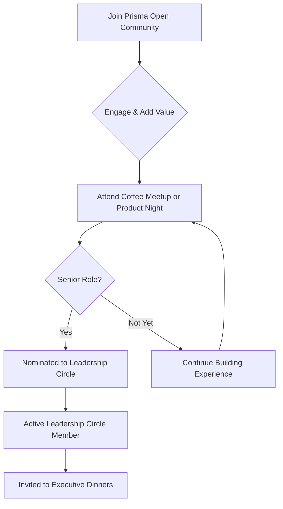

> ⛔ NON-NEGOTIABLE: DO NOT EDIT THIS DOCUMENT unless explicitly requested/solicited. Fixed business context. Unintended agentic changes prohibited.
> ⛔ NO NEGOCIABLE: NO EDITAR ESTE DOCUMENTO salvo solicitud explícita. Contexto de negocio fijo. Prohibidas modificaciones agenticas no intencionadas.

---

# Prisma Community – Groups, Tiers & Activities

## Overview

Prisma is a curated product management community that connects leaders and high-potential professionals through structured, high-signal interactions.

Our activities are designed using a MECE framework (Mutually Exclusive, Collectively Exhaustive) to ensure every initiative serves a clear strategic purpose—whether that's learning, relationship building, or community coordination.

## MECE Community Activities Framework

### Activity Classification Matrix

| **Scale** | **Seniority Level** | **Activity Type** | **Primary Purpose** |
|-----------|--------------------|--------------------|--------------------| 
| **Massive (200+)** | Mixed seniority | World Product Day | Industry celebration & thought leadership |
| **Medium (25–40)** | Senior & Executive | Product Nights | Strategic learning & networking |
| **Intimate (8–15)** | Senior+ & Executive+ | Coffee Meetups, Dinners | Peer sharing, conversion & qualification |

### Activity Categories & Strategic Purpose

#### 📚 Learning & Development
- **Product Nights** – Monthly expert-led sessions delivering tactical frameworks and non-googleable insights.
- **World Product Day** – Annual full-day celebration of product management excellence.

#### 🤝 Relationship & Trust Building
- **Leadership Dinners** – Intimate, invite-only gatherings for long-term executive relationships.
- **Leadership Circle** – Private peer advisory space for senior product leaders.

#### 📢 Information & Coordination
- **Prisma Open Community** – Central hub for event coordination, opportunities, and shared resources.
- **Community Announcements** – Targeted updates via LinkedIn and direct messaging for senior roles.

## MECE Activity Breakdown

### 🔥 Conversion Activities
*Purpose: Turn prospects into qualified, engaged members.*

#### Senior Coffee Meetups
- **Scale**: 8–20 (intimate)
- **Audience**: Senior+ PMs (Lead/Director+)
- **Format**: 2.5h "emergency meeting" style discussions on industry shifts
- **Goal**: 60%+ conversion into Prisma tools/community
- **Path**: Direct qualification for Leadership Circle consideration
- **Frequency**: Monthly

### 📚 Learning Activities
*Purpose: Deliver strategic education and elevate practice.*

#### Product Nights
- **Scale**: 25–40 (medium)
- **Audience**: Senior+ PMs; select mid-level with exceptional track records
- **Format**: 3h after-office event with expert presentations
- **Goal**: Tactical frameworks & unique industry insights
- **Path**: Qualifies attendees for Leadership Circle consideration
- **Frequency**: Monthly

#### World Product Day
- **Scale**: 200–500 (massive)
- **Audience**: Mixed seniority, curated for impact
- **Format**: Full-day conference celebrating the "Golden Age of Product"
- **Goal**: Inspire, position Prisma as a thought leader, surface high-value contacts
- **Frequency**: Annual

### 🤝 Relationship Activities
*Purpose: Build trust and lasting professional bonds.*

#### Executive Dinners
- **Scale**: 8–10 (exclusive)
- **Audience**: VP, CPO, Founder-level leaders
- **Format**: 3h premium dinners, off-the-record
- **Goal**: Strategic partnerships, high-trust advisory relationships
- **Access**: Leadership Circle members only
- **Frequency**: Quarterly

### 📢 Coordination Activities
*Purpose: Keep the community informed and aligned.*

#### Prisma Open Community
- **Scale**: 300+ (digital)
- **Audience**: All product-related professionals
- **Format**: WhatsApp/Telegram hub
- **Goal**: Announcements, job sharing, resources
- **Access**: LinkedIn verification required

#### Leadership Circle (Digital)
- **Scale**: Max 20 members
- **Audience**: Senior executives and proven contributors
- **Format**: Private WhatsApp group
- **Goal**: Confidential peer advisory, strategic decision-making
- **Access**: Event participation + nomination

## Community Tiers

### 🌐 Tier 1 – Prisma Open Community
**Platform**: WhatsApp/Telegram | **Members**: 300+

#### Purpose:
- Professional product discussions
- Job opportunities  
- Event and resource sharing

#### Access:
- Product, design, or engineering leadership in Peru
- LinkedIn verification

#### Guidelines:
- Professional, high-signal discussions
- Salary ranges required for job posts
- No spam/self-promotion
- Product-related events only

### 🎯 Tier 2 – Prisma Leadership Circle
**Platform**: Private WhatsApp | **Members**: Max 20

#### Purpose:
- Confidential senior-level conversations
- Strategic decision-making
- Executive-level learning and support

#### Requirements:
- Attend one qualifying Prisma event (Coffee Meetup, Product Night, Executive Dinner)
- Hold a senior leadership role (Head/Director/VP/CPO, Founder, or 5+ years leading product teams with P&L)
- Be nominated by an existing member and pass vetting

#### Benefits:
- Monthly senior-only dinners
- First access to opportunities
- International speaker sessions
- Peer mentorship

#### Rules:
- 🔒 **Vegas Rule** – Confidentiality is mandatory
- 💎 **Share unique, high-value insights**
- 🔄 **Contribute monthly or exit**
- 🚫 **No low-signal chatter**
- 🎖️ **Maintain senior role status**

### 🍷 Tier 3 – Prisma Executive Dinners
**Format**: In-person | **Capacity**: 8–10

#### Purpose:
- Strategic deep-dives
- Peer problem-solving
- High-trust relationship building

#### Access:
- Active Leadership Circle member with 3+ months of contributions
- RSVP commitment
- Willingness to host in future

## Communication Channel Strategy

### **MECE Channel Classification**

| **Channel** | **Target Segment** | **Primary Use** | **Communication Style** |
|-------------|-------------------|-----------------|-------------------------|
| **WhatsApp Open** | Tier 1 (300+ members) | Event announcements, job sharing | Semi-formal, broadcast |
| **WhatsApp Leadership** | Tier 2 (20 members) | Strategic discussions, peer advisory | Informal, high-trust |
| **LinkedIn** | All tiers + prospects | Professional outreach, thought leadership | Formal, public |
| **Email/Direct** | Event attendees | Invitations, follow-ups, confirmations | Formal, personal |
| **In-Person Events** | Tier-specific | Primary relationship building | Interactive, experiential |

---

### **📱 Digital Communication Channels**

#### **WhatsApp Open Community**
- **Target Segment**: Tier 1 - All product professionals (300+ members)
- **Primary Uses**:
  - Event announcements and RSVP coordination
  - Job opportunity sharing with salary transparency
  - Resource distribution (frameworks, tools, content)
  - Community updates and logistics
- **Communication Protocol**: 
  - Semi-formal tone, professional content only
  - Broadcast-style announcements from admins
  - Member discussions encouraged but moderated
  - No spam, self-promotion, or low-value content
- **Content Types**: Event invites, job postings, industry resources, community guidelines

#### **WhatsApp Leadership Circle**
- **Target Segment**: Tier 2 - Senior executives (max 20 members)
- **Primary Uses**:
  - Confidential strategic discussions
  - Peer advisory and problem-solving
  - Executive-level knowledge sharing
  - Private networking and introductions
- **Communication Protocol**:
  - Informal, high-trust environment
  - "Vegas Rule" - complete confidentiality
  - High-signal content only, no social chatter
  - Monthly contribution requirement
- **Content Types**: Strategic insights, confidential challenges, executive introductions, industry intelligence

#### **LinkedIn Professional Network**
- **Target Segment**: All tiers + prospective members
- **Primary Uses**:
  - Thought leadership content distribution
  - Professional outreach for event invitations
  - Public community positioning and branding
  - Prospect identification and qualification
- **Communication Protocol**:
  - Formal, professional business tone
  - Public-facing brand representation
  - Thought leadership and expertise demonstration
  - Strategic networking and relationship building
- **Content Types**: Industry insights, event promotions, community highlights, professional achievements

#### **Email & Direct Communication**
- **Target Segment**: Event attendees and qualified prospects
- **Primary Uses**:
  - Personal event invitations and confirmations
  - Follow-up communications after events
  - One-on-one relationship building
  - Exclusive opportunity notifications
- **Communication Protocol**:
  - Formal but personalized tone
  - Direct relationship building focus
  - Customized messaging based on segment
  - Timely and relevant communications
- **Content Types**: Event invitations, follow-up messages, opportunity alerts, personalized introductions

---

### **🤝 In-Person Communication Channels**

#### **Coffee Meetups (Conversion Events)**
- **Target Segment**: Senior PM prospects + select Tier 1 members
- **Communication Purpose**: Convert prospects into qualified community members
- **Format**: 2.5-hour intimate discussions, emergency meeting style
- **Communication Style**: Peer-to-peer, vulnerability-based, conversion-focused

#### **Product Nights (Learning Events)**
- **Target Segment**: Tier 1 + qualified prospects
- **Communication Purpose**: Deliver strategic education and qualify for Tier 2
- **Format**: 3-hour expert presentations with structured networking
- **Communication Style**: Expert-to-peer, educational, qualification-focused

#### **Executive Dinners (Relationship Events)**
- **Target Segment**: Tier 2 Leadership Circle members only
- **Communication Purpose**: Build deep executive relationships and trust
- **Format**: 3-hour premium dinners, off-the-record discussions
- **Communication Style**: Executive-to-executive, confidential, relationship-focused

#### **World Product Day (Positioning Events)**
- **Target Segment**: Mixed seniority, curated for impact
- **Communication Purpose**: Industry positioning and mass relationship building
- **Format**: Full-day conference with keynotes and networking
- **Communication Style**: Industry-to-community, inspirational, positioning-focused

---

### **Channel Integration & Progression**

#### **Prospect Journey Communication Flow**:
1. **LinkedIn** → Initial professional outreach and qualification
2. **Email** → Personal event invitation and logistics
3. **Coffee Meetup** → Face-to-face conversion experience  
4. **WhatsApp Open** → Community integration and ongoing engagement
5. **Product Night** → Continued education and Tier 2 qualification
6. **WhatsApp Leadership** → Executive-level peer advisory access
7. **Executive Dinners** → Deep relationship building and strategic advisory

#### **Communication Frequency by Channel**:
- **WhatsApp Open**: Daily discussions, weekly announcements
- **WhatsApp Leadership**: Daily strategic discussions, minimal social content
- **LinkedIn**: 2-3x weekly thought leadership, event promotions
- **Email**: Event-driven (invitations, follow-ups, confirmations)
- **In-Person**: Monthly Coffee Meetups, Monthly Product Nights, Quarterly Executive Dinners, Annual World Product Day

---

## Progression Path

